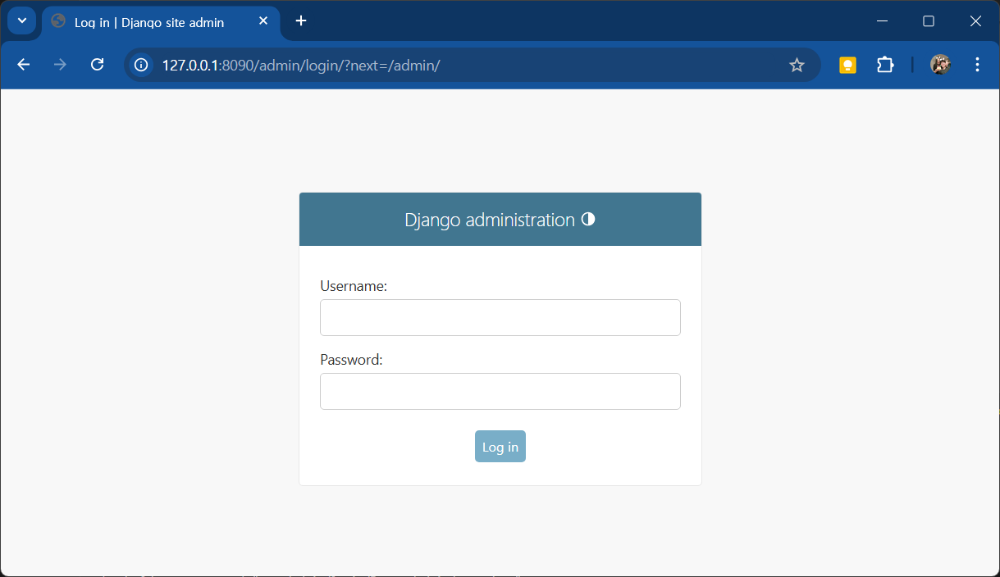

# 장고 웹 블로그 클로닝

## 장고 설치
```shell
> pip install django
```

## 장고 환경설정
```shell
django_web> mkdir mysite
django_web> cd mysite
django_web/mysite> django-admin startproject tutorialjango .
django_web/mysite> python manage.py migrate
...
Applying auth.0012_alter_user_first_name_max_length... OK
Applying sessions.0001_initial... OK
```

### settings.py 설정
- ALLOWED_HOSTS의 리스트 내 *(모든 사용자 접속 허가) 추가

### 서버 실행
```shell
(venv-web) PS .../django_web/mysite > python manage.py runserver 127.0.0.1:8090
```

## 장고에 메인페이지 생성
```shell
/django_web/mysite > python manage.py startapp main
```


### settings.py 설정
- INSTALLED_APPS 에 main 추가

### urls.py 작성
```python
from django.urls import path
from main.views import index

urlpatterns = [
    path('admin/', admin.site.urls),
    path('', index),
]
```

### mysite.main.views 작성
```python
def index(request):
    return render(request, 'main/index.html')
```

### index.html 작성
- mysite.main.templates.main 아래 index.html 작성
```html

```

### 서버 재실행
```shell
(venv-web) PS .../django_web/mysite > python manage.py runserver 127.0.0.1:8090
```


### 관리자 모드
- http://127.0.0.1:8090/admin 접속확인

