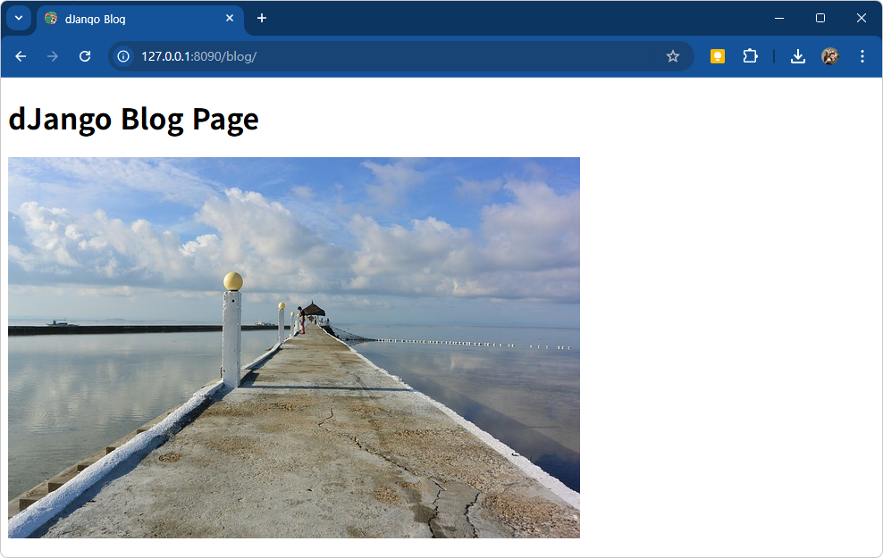

# 장고 웹 블로그 클로닝

## 장고 설치
```shell
> pip install django
```

## 장고 환경설정
```shell
django_web> mkdir mysite
django_web> cd mysite
django_web/mysite> django-admin startproject tutorialjango .
django_web/mysite> python manage.py migrate
...
Applying auth.0012_alter_user_first_name_max_length... OK
Applying sessions.0001_initial... OK
```

### settings.py 설정
- ALLOWED_HOSTS의 리스트 내 *(모든 사용자 접속 허가) 추가

### 서버 실행
```shell
(venv-web) PS .../django_web/mysite > python manage.py runserver 127.0.0.1:8090
```

## 장고에 메인페이지 생성
```shell
/django_web/mysite > python manage.py startapp main
```


### settings.py 설정
- INSTALLED_APPS 에 main 추가

### urls.py 작성
```python
from django.urls import path
from main.views import index

urlpatterns = [
    path('admin/', admin.site.urls),
    path('', index),
]
```

### mysite.main.views 작성
```python
def index(request):
    return render(request, 'main/index.html')
```

### index.html 작성
- mysite.main.templates.main 아래 index.html 작성
```html

```

### 서버 재실행
```shell
(venv-web) PS .../django_web/mysite > python manage.py runserver 127.0.0.1:8090
```


### 관리자 모드
- http://127.0.0.1:8090/admin 접속확인


### static 폴더 생성
- mysite 아래 static 폴더 생성
- static 폴더에 이미지 저장

- settings.py 파일 수정

    ```py
    # LANGUAGE_CODE = 'en-us'
    LANGUAGE_CODE = 'ko-kr'
    TIME_ZONE = 'Asis/Seoul'
    USE_I18N = True
    USE_TZ = True

    # Static files (CSS, JavaScript, Images)
    # https://docs.djangoproject.com/en/4.2/howto/static-files/

    STATIC_URL = 'static/'
    STATICFILES_DIRS = ( 
        os.path.join(BASE_DIR, 'static'),
    )
    ```

- index.html  수정

    ```html
    <body>
        <h1>dJango Main Page</h1>
        
        
    </body>
    ```

    


## 장고 모델
- MTV(Model Template View) 로 호칭

### 블로그 페이지 생성
- urls.py 파일 수정

    ```py
    from main.views import index, blog

    urlpatterns = [
        path('admin/', admin.site.urls),
        path('', index),
        path('blog/', blog),
    ]
    ```

- views.py 수정

    ```py
    def blog(request):
        return render(request, 'main/blog.html')
    ```

- blog.html 생성

    ```html
        <title>dJango Blog</title>
        
        <link rel="icon" href="" type="image/x-icon">
    </head>
    <body>
        <h1>dJango Blog Page</h1>
        
        
    </body>
    </html>
    ```

    

